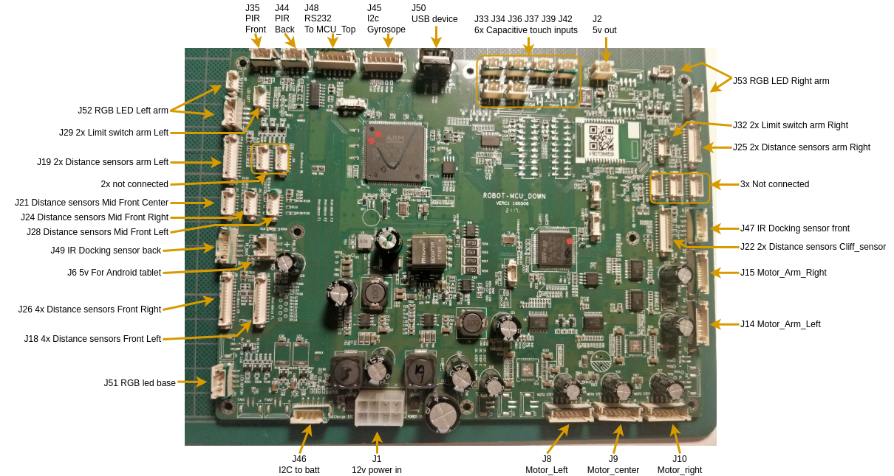

# MCU_Down hardware

## Connectors:

### Power in (J1)

|   GND  |   GND  |   GND  |   GND  |
|----------|----------|----------|----------|
|   Logic_12V  |   Logic_12V  |   Motor_12V  |   Motor_12V  |

---

### Motors (J8 J9 J10 J14 J15)

|      | Pin 1 | Pin 2 | Pin 3 | Pin 4 | Pin 5 | Pin 6 | Pin 7 | TIMER|
|----------|----------|----------|----------|----------|----------|----------|----------|----------|
|             |         encoder_A  |   Enable  |   PWM  |   encoder_B  |   Dir  |   GND  |   12v  | |
|  Motor Left       |  -  |   PF2  |   PB15  |  -  |  PF3   |  -   |  -   | | 
|  Motor Center     |  -  |   PF0  |   PF7   |  -  |  PF1   |  -   |  -   |TIM11| 
|  Motor Right      |  -  |   PF4  |   PB14  |  -  |  PF5   |  -   |  -   || 
|  Motor Left Arm   |  -  |   PE2  |   PE5   |  -  |  PE1   |  -   |  -   |TIM9| 
|  Motor Right Arm  |  -  |   PE4  |   PE6   |  -  |  PE3   |  -   |  -   |TIM9| 

**Notes Matthijs:**
 - IO pins are correct.
 - Enable is active high 3.3v (= Brake disable)
 - In the new firmware **Enable** is called **Brake** as the motor feels locked when this IO pin is **LOW**
 - Left arm motor runs opposite direction of Right arm
 
 **PWM generator for the motors**
 - TIM12 is used for the **Left** and **Right** base motors

- TIM12 - Channel 1 = right base
- TIM12 - Channel 2 = left base
 .
 - TIM11 is used for the **Center** base motor
- TIM11 - Channel 1 = center
. 
 - TIM9 is used to for the **Arm** motors.
 - TIM9 - Channel 1 = left arm
 - TIM9 - Channel 2 = right arm 
 .
 - Prescaler 15 (+1) = 16 --> 16 MHz / 16 = 1 MHz)
 - Period = 100 count --> 10 kHz duty cycle (should be 99?)  
- PWM 100% = 0 speed.
- PWM 50% = 50% speed.
- PWM 0% = 100% speed.
- ALL motors have **internal speed controller**. The PWM is the setpoint.

**Brakes**
- All brakes work and pins are correct.

---
### Encoder counter
- The "small" STM32F103 on the "down" board counts the pulses from the 5 encoders.
- When an encoder changes, a message is send to the main STM32F2.
- UART settings 115200, 8n1. Only TX from the 2nd IC. No TX from main STM32F2.
- Max update rate = 16.6 (17) Hz.
- Pulses counted since last message are send. Not the total pulse count.

**Protocol:**
- Message size = 15 bytes
- Bytes 0, 1, 2, 3 are fixed (?) or not relevant [0xff 0x01 0x01 0x00]
- Bytes 4, 6, 8, 10, 12 are the delta counts since last message
- Bytes 5, 7, 9, 11, 13 have value 0x80 when the delta value is **negative**. 0x00 when **positive**. 
- Byte 14 seems to be a CRC value. Not investigated which algoritm is used.
---

### Limit switches arms (J29 J32)

|**LEFT**  | Pin 1    | Pin 2    | Pin 3    | Pin 4    | Pin 5    |
|----------|----------|----------|----------|----------|----------|
|Color     | White    | Black    | Black    |  Black   | Black    |
|Left      | Arm full up| 1.1V   |  Arm full back|  1.1 1V|  GND   |
|IO Pins   | PG11      |     -    | PG10      |      -   | -        |

| **RIGHT**| Pin 1    | Pin 2    | Pin 3    | Pin 4    | Pin 5    |
|----------|----------|----------|----------|----------|----------|
|Color     | White    | Black    | Black    |  Black   | Black    |
|Right     | Arm full back| 1.1 V   | Arm full up|  1.1 V   |   GND   |
|IO Pins   |  PG0     |     -    |  PG1     |      -   | -        |

Notes Matthijs:
* IO pins are correct.

---

### RGB LED (J51 J52 J53)

|    | Pin 1 | Pin 2 | Pin 3 | Pin 4 |
|----------|----------|----------|----------|----------|
|          |   GND  |   Red  |   Green  |   Blue  |
| Wing Left  |     |   PH13  |   PH14  |   PH15  |
| Wing Right |     |   PD10  |   PD14  |   PD15  |
| Bottom     |     |   PG12  |   PG13  |   PG15  |

Notes Matthijs:
* IO pins are correct.
* Pull pins **DOWN** to turn LED **ON**

---

### Touch Sensors (J33 J34 J36 J37 J39 J42)

| Pin 1 | Pin 2 |
|----------|----------|
|   GND  |   Sense  |

STM32F2 connections:
| Touch0 | Touch1 | Touch2 | Touch3 | Touch4 | Touch5 | Touch6 | Touch7 |
|----------|----------|----------|----------|----------|----------|----------|----------|
|   PE7  |   PE8  |   PE9  |   PE10  |   PE12  |   PE13  |   PE14  |   PE15  |

---

### PIR Sensors (J35 J44)

|     | Pin 1 | Pin 2 | Pin 3 |
|----------|----------|----------|----------|
| Signals |   Motion |   GND  |   5v  |
| Front sensor|   PG8 |   -  |   -  |
| Back sensor|   PG7 |   -  |   -  |

Notes Matthijs:
* IO pins are correct.

---
Connector for LEFT sensors has 1 pin less than RIGHT connector has.
### Distance sensors 4x (J18) (Left 4 sensors, 13 pins)

|     | Pin 1 | Pin 2 | Pin 3 | Pin 4 | Pin 5 | Pin 6 | Pin 7 | Pin 8 | Pin 9 | Pin 10 | Pin 11 | Pin 12 | Pin 13 |
|----------|----------|----------|----------|----------|----------|----------|----------|----------|----------|----------|----------|----------|----------|
| Signals |  3.3v  |   SCL  |   GND  |   SDA  |   GND | EN1  |   EN2  |   EN3  |   EN4  |   NC  |   NC  |   NC  |   NC  |
| IO Pin |   - |  PB8   |-     |  PB9   | -   | PI4  |  PI5   | PI6 |  PI7   | -    | -    | -    |  -   |

### Distance sensors 4x (J26) (Right 4 sensors, 14 pins)

|     | Pin 1 | Pin 2 | Pin 3 | Pin 4 | Pin 5 | Pin 6 | Pin 7 | Pin 8 | Pin 9 | Pin 10 | Pin 11 | Pin 12 | Pin 13 | Pin 14 |
|----------|----------|----------|----------|----------|----------|----------|----------|----------|----------|----------|----------|----------|----------|----------|
| Signals |  3.3v  |   SCL  |   GND  |   SDA  |   GND | EN1  |   EN2  |   EN3  |   EN4  |   NC  |   NC  |   NC  |   NC  |   NC  |
| IO Pin |   - |  PC0   |-     | PC1    | -   |  PC2 |  PC3   | PA1 | PA2    | -    | -    | -    |  -   |     -|

### Cliff sensors 2x (J22) (2 Front sensors, 13 pins)

|     | Pin 1 | Pin 2 | Pin 3 | Pin 4 | Pin 5 | Pin 6 | Pin 7 | Pin 8 | Pin 9 | Pin 10 | Pin 11 | Pin 12 | Pin 13 | Pin 14 |
|----------|----------|----------|----------|----------|----------|----------|----------|----------|----------|----------|----------|----------|----------|----------|
| Signals |  3.3v  |   SCL  |   GND  |   SDA  |   GND | EN1  |   EN2  |   NC  |   NC  |   NC  |   NC  |   NC  |   NC  |   NC  |
| IO Pin |   - |  PC4   |-     |  PC5   | -   | PB1  | PB0    |  |     | -    | -    | -    |  -   |     -|

Notes Matthijs:
* IO pins are correct.
* Soft I2C created as fast as possible. But pin mode switching in slow.

---

### Distance sensor 4x (7x) (J19)(Arm Left & Right???)

| Pin 1 | Pin 2 | Pin 3 | Pin 4 | Pin 5 | Pin 6 | Pin 7 | Pin 8 | Pin 9 | Pin 10 | Pin 11 | Pin 12 |
|----------|----------|----------|----------|----------|----------|----------|----------|----------|----------|----------|----------|
|   3.3v  |   SCL  |   GND  |   SDA  |   GND  |   EN1  |   EN2  |   EN3  |   EN4  |   EN5  |   EN6  |   EN7  |
|     |   PD7  |     |   PD6  |     |   PD5  |   PD4  |   PD3  |   PD2  |   PD1  |   PD0  |   PC12  |

 - Uses the sharp [GP2Y0E03](https://nl.mouser.com/ProductDetail/Sharp-Microelectronics/GP2Y0E03?qs=2FIyTMJ0hNk7Anrxo3D7Gw%3D%3D)
 - Sensors are connected in parallel to the 3.3v, GND, SCL, and SDA and each sensor has a ENable line
 - Enable line is set to high, after >500us the distance can be read over I2c
 - The sensor I2c is not connected to I2c peripheral in the stm32, a software implementation needs to be used. 

---

### Distance sensors mid front 1x (J21 J24 J28)

|  | Pin 1 | Pin 2 | Pin 3 | Pin 4 | Pin 5 | Pin 6 |
|----------|----------|----------|----------|----------|----------|----------|
| Signal |   3.3v  |   CLK  |    3.3v   |   CS  |   GND  |   Data  |
| J21    |   -  |   PI0 |    -   |   PI2  |   -  |   PI1  |
| J24    |   -  |   PI0 |    -   |   PI3  |   -  |   PI1  |
| J28    |   -  |   PI0 |    -   |   PA15  |   -  |   PI1  |

 - CLK of J21 J24 J28 are connected in parrelel with a 22R resistor per connector
 - Data of J21 J24 J28 are connected in parrelel with a 22R resistor per connector
 - CLK and Data have 2K2 pullups to 3.3v
 - Clk @ 121 Khz 

Notes Matthijs:
* IO pins are correct.
* Soft I2C created as fast as possible. But pin mode switching in slow.
---

### IMU Board 1x (J45)

Most WEST pin is 1 (+3.3V)
| Pin 1 | Pin 2 | Pin 3 | Pin 4 | Pin 5 | Pin 6 |
|----------|----------|----------|----------|----------|----------|
|   3.3v  |   GND  |    SDA   |   SCL  |   INT_GYRO  | INT_MAG |

The external board contains:
 - STMicroelectronics LSM6DSL Gyroscope + accelerometer
 - STMicroelectronics LSM303AH Magnetometer + accelerometer

| IC | Sensor | Write addr | Read addr | Used signals|
|----------|----------|----------|----------|----------|
|LSM6DSL	|3D accelerometer and 3D gyroscope	|0xd4	|0xd5	|Linear accel & Rotational accel|                
|LSM303AH	|Magnetic field sensor	|0x3c	|0x3d	|Compass X Y Z|                
|LSM303AH	|Linear acceleration sensor	|0x3a	|0x3b	|Not used?|

#### LSM6DSL (0xd4/0xd5)
|Registers| Name | Meaning| 
|-----   |----| ----  |
|  0x1e  |STATUS_REG  | Status|
|  0x22  | OUTX_L_G   |Angular acceleration Pitch Low Byte|
|  0x23  | OUTX_H_G   |Angular acceleration Pitch High Byte|
|  0x24  | OUTY_L_G   |Angular acceleration Roll Low Byte|
|  0x25  | OUTY_H_G   |Angular acceleration Roll High Byte|
|  0x26  | OUTZ_L_G   |Angular acceleration Yaw Low Byte|
|  0x27  | OUTZ_H_G   |Angular acceleration Yaw High Byte|
|  0x28  | OUTX_L_XL  |Linear acceleration X Low Byte|
|  0x29  | OUTX_H_XL  |Linear acceleration X High Byte|
|  0x2a  | OUTY_L_XL  |Linear acceleration Y Low Byte|
|  0x2b  | OUTY_H_XL  |Linear acceleration Y High Byte|
|  0x2c  | OUTZ_L_XL  |Linear acceleration Z Low Byte|
|  0x2d  | OUTZ_H_XL  |Linear acceleration Z High Byte|

#### LSM303AH (0x3c/0x3d)
|Registers| Name | Meaning|
|-----|----|----|
|  0x68  | OUTX_L_REG_M  |X magnetic data Low Byte |
|  0x69  | OUTX_H_REG_M  |X magnetic data High Byte |
|  0x6a  | OUTY_L_REG_M  |Y magnetic data Low Byte |
|  0x6b  | OUTY_H_REG_M  |Y magnetic data High Byte |
|  0x6c  | OUTZ_L_REG_M  |Z magnetic data Low Byte |
|  0x6d  | OUTZ_H_REG_M  |Z magnetic data High Byte |

#### Interrupts

Interrupts are triggered when a certain threshold is exceeded.
Most likely configured during startup. 
* Maybe not need when using polling?
* Maybe default values are good enough?

|Registers| Value|
|-----|----|
|CFG_REG_A_M (60h)          | 0b00000000|
|OFFSET_X_REG_L_M (45h)     | 0|
|OFFSET_X_REG_H_M (46h)     | 0|
|OFFSET_Y_REG_L_M (47h)     | 0|
|OFFSET_Y_REG_H_M (48h)     | 0|
|OFFSET_Z_REG_L_M (49h)     | 0|
|OFFSET_Z_REG_H_M (4Ah)     | 0|

The offset cancellation feature is controlled through the CFG_REG_B_M register (for the magnetometer) on the LSM303AH.
Set the OFFSET_CANC bit to 1 in the CFG_REG_B_M register. This will enable automatic offset cancellation.
To ensure continuous offset cancellation, set the SET_FREQ bit to 1 in the same CFG_REG_B_M register.

|Registers| Value|
|-----|----|
|CFG_REG_B_M (61h)|           0b00000111|

---

### Battery + Charger (J46)

| Pin 1 | Pin 2 | Pin 3 | Pin 4 | Pin 5 |
|----------|----------|----------|----------|----------|
|   SCL  |   SDA  |   GND?  |   charging_complete? |   Charger inserted  |

The external board contains:
 - 5 wires down to Charger board
 - 3 wires to Battery BMS (SCL, SDA, GND)
 - Battery has the TI BQ3055 battery manager IC
 - Charging_complete is pulled to GND when the battery is full
 - Charging line is pulled to GND during charging, when not charging its at 3.3v

---

### IR Docking sensor 1x (J47 J49)

| Pin 1 | Pin 2 | Pin 3 | Pin 4 | Pin 5 |
|----------|----------|----------|----------|----------|
|   IN_R  |   IN_M  |    IN_L   |   GND  |   3.3  |

 - Read 3 IR Receivers for docking,
 - Dock transmits IR Light, based on what receiver sees the light a heading can be determinant.
 - Middle receiver can only see in a small slit

