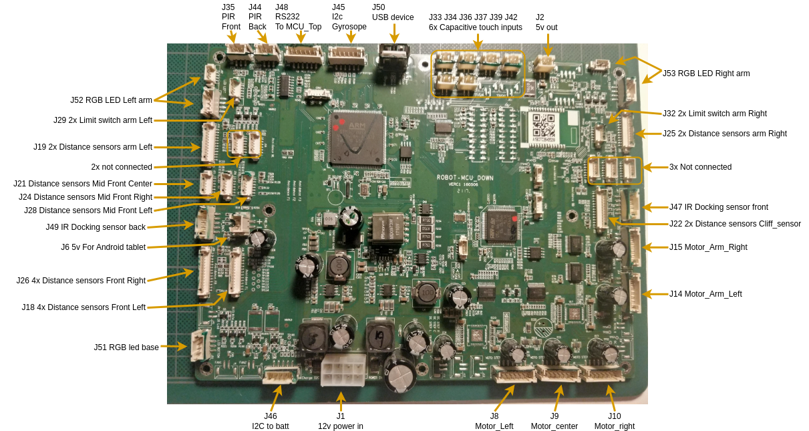

# MCU_Down hardware

## Connectors:

### Power in (J1)

|   GND  |   GND  |   GND  |   GND  |
|----------|----------|----------|----------|
|   Logic_12V  |   Logic_12V  |   Motor_12V  |   Motor_12V  |

---

### Motors (J8 J9 J10 J14 J15)

| Pin 1 | Pin 2 | Pin 3 | Pin 4 | Pin 5 | Pin 6 | Pin 7 |
|----------|----------|----------|----------|----------|----------|----------|
|   encoder_A  |   Enable  |   PWM  |   encoder_B  |   Dir  |   GND  |   12v  |

 - PWM is at 10Khz 3.3v
 - Enable is active low 3.3v
 - DIR pull down to reverse motor direction 3.3v

---

### RGB LED (J51 J52 J53)

|    | Pin 1 | Pin 2 | Pin 3 | Pin 4 |
|----------|----------|----------|----------|----------|
|          |   GND  |   Red  |   Green  |   Blue  |
|  |  |  |  |  |
| Wing Left  |     |   PH13  |   PH14  |   PH15  |
| Wing Right |     |   PD10  |   PD14  |   PD15  |
| Bottom     |     |   PG12  |   PG13  |   PG15  |

---

### Touch Sensors (J33 J34 J36 J37 J39 J42)

| Pin 1 | Pin 2 |
|----------|----------|
|   GND  |   Sense  |

STM32F2 connections:
| Touch0 | Touch1 | Touch2 | Touch3 | Touch4 | Touch5 | Touch6 | Touch7 |
|----------|----------|----------|----------|----------|----------|----------|----------|
|   PE7  |   PE8  |   PE9  |   PE10  |   PE12  |   PE13  |   PE14  |   PE15  |

---

### Pir Sensors (J35 J44)

| Pin 1 | Pin 2 | Pin 3 |
|----------|----------|----------|
|   signal  |   GND  |   5v  |

---

### Distence sensor 4x (J26)

| Pin 1 | Pin 2 | Pin 3 | Pin 4 | Pin 5 | Pin 6 | Pin 7 | Pin 8 | Pin 9 | Pin 10 | Pin 11 | Pin 12 | Pin 13 | Pin 14 |
|----------|----------|----------|----------|----------|----------|----------|----------|----------|----------|----------|----------|----------|----------|
|   3.3v  |   CLK  |   GND  |   Data  |   CS1  |   CS2  |   CS3  |   CS4  |   NC  |   NC  |   NC  |   NC  |   NC  |   NC  |

---

### Distence sensor 4x (7x) (J19)

| Pin 1 | Pin 2 | Pin 3 | Pin 4 | Pin 5 | Pin 6 | Pin 7 | Pin 8 | Pin 9 | Pin 10 | Pin 11 | Pin 12 |
|----------|----------|----------|----------|----------|----------|----------|----------|----------|----------|----------|----------|
|   3.3v  |   SCL  |   GND  |   SDA  |   GND  |   EN1  |   EN2  |   EN3  |   EN4  |   EN5  |   EN6  |   EN7  |
|     |   PD7  |     |   PD6  |     |   PD5  |   PD4  |   PD3  |   PD2  |   PD1  |   PD0  |   PC12  |

 - uses the sharp [GP2Y0E03](https://nl.mouser.com/ProductDetail/Sharp-Microelectronics/GP2Y0E03?qs=2FIyTMJ0hNk7Anrxo3D7Gw%3D%3D)
 - sensors are connected in parallel to the 3.3v, GND, SCL, and SDA and each sensor has a ENable line
 - Enable line is set to high, after >500us the distance can be read over I2c
 - the sensor I2c is not connected to I2c peripheral in the stm32, a software implementation needs to be used. 

---

### Distence sensor 1x (J21 J24 J28)

| Pin 1 | Pin 2 | Pin 3 | Pin 4 | Pin 5 | Pin 6 |
|----------|----------|----------|----------|----------|----------|
|   3.3v  |   CLK  |    3.3v   |   CS  |   GND  |   Data  |

 - CLK of J21 J24 J28 are connected in parrelel with a 22R resistor per connector
 - Data of J21 J24 J28 are connected in parrelel with a 22R resistor per connector
 - CLK and Data have 2K2 pullups to 3.3v
 - Clk @ 121 Khz 

---

### IMU Board 1x (J45)

| Pin 1 | Pin 2 | Pin 3 | Pin 4 | Pin 5 | Pin 6 |
|----------|----------|----------|----------|----------|----------|
|   3.3v  |   GND  |    SDA   |   SCL  |   INT_GYRO  | INT_MAG |

The external board contains:
 - STMicroelectronics LSM6DSL Gyroscope + accelerometer
 - STMicroelectronics LSM303AH Magnetometer + accelerometer

---

### Battery + Charger (J46)

| Pin 1 | Pin 2 | Pin 3 | Pin 4 | Pin 5 |
|----------|----------|----------|----------|----------|
|   SCL  |   SDA  |   GND?  |    Charging   |   charging_complete?   |

The external board contains:
 - 5 wires down to Charger board
 - 3 wires to Battery BMS (SCL, SDA, GND)
 - Battery has the TI BQ3055 battery manager IC

---

### IR Docking sensor 1x (J47 J49)

| Pin 1 | Pin 2 | Pin 3 | Pin 4 | Pin 5 |
|----------|----------|----------|----------|----------|
|   IN_R  |   IN_M  |    IN_L   |   GND  |   3.3  |

 - Read 3 IR Receivers for docking,
 - Dock transmits IR Light, based on what receiver sees the light a heading can be determinant.
 - Middle receiver can only see in a small slit

