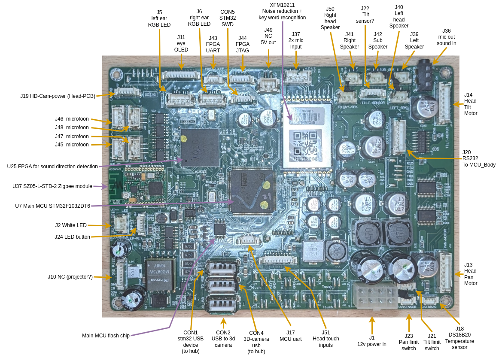

# MCU_Down hardware

[!CAUTION]
connector is 180deg rotated compart to body_pcb! 

---
## Connectors:
### Power in (J1)
|   Logic_12V  |   Logic_12V  |   Motor_12V  |   Motor_12V  |
|----------|----------|----------|----------|
|   GND  |   GND  |   GND  |   GND  |

---
### USB Enable
The UBS port/hub needs a low enable signal to work.
|   Item |   Pin  |   LOW  |
|----------|----------|----------|
|   USB port enable  |   PG1  |   LOW  |

---
### RGB LED (J5 & J6)

|  Item        |      Red  |   Green  |   Blue  |
|----------|----------|----------|----------|
| Head Left  |   PE8  |   PE10  |   PE12  |
| Head Right |   PD13  |   PD14  |   PD15  |

Notes Matthijs:
* IO pins are correct.
* Pull pins **DOWN** to turn LED **ON**
* All pins **HIGH** = **WHITE**

---

### HEAD Pan & Tilt motors (J13 & J14)

|  Item     | Encoder Ch1  |   Encoder Ch2  |   PWM | DIR | ENABLE|
|---------- |-------------|----------|----------|---------|----------|
| Head PAN  | TIM3 CH1-PC6  | TIM3 CH2-PC7    |  TIM8 CH4 - PC9   | PD12 | PE15|
| Head TILT | TIM1 CH1-PE9    |TIM1 CH2-PE11  |TIM8 CH 3 - PC8|  PD11   | PE14| 

|  Item     | Limit Pos/Up  |  Limit Neg/Down  |
|---------- |-------------|----------|
| Head PAN  |  PF2 |  PF3  | 
| Head TILT | PF4 | PF5 |

